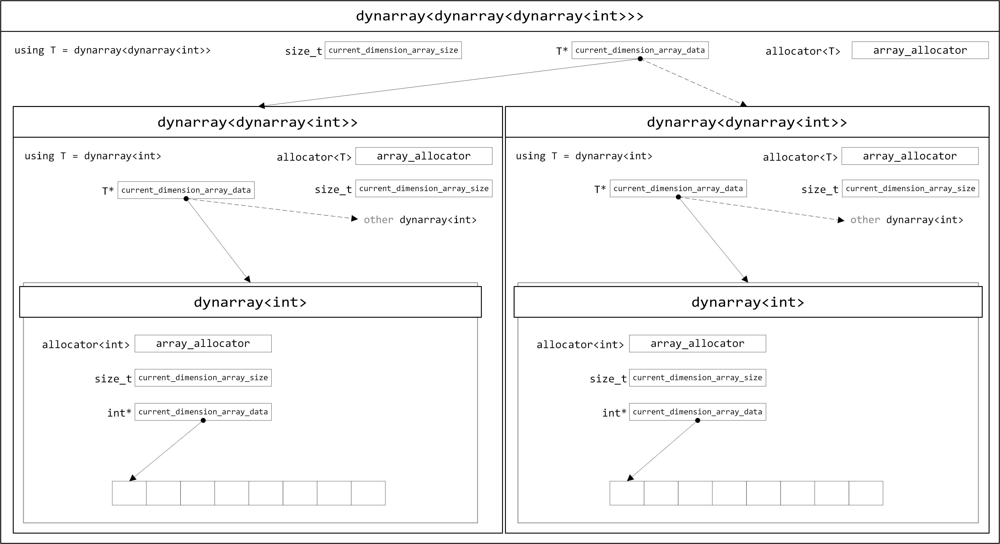

# VLA for C++: dynarray

[简中版介绍在这里](README_zh_CN.md)

[繁中版介紹在這裏](README_zh_HK.md)

A header-only library, providing C99 VLA-like class for C++. The VLA extension provide by compiler is **not** required.

## Depencencies

C++ 14 or 17

C++ Standard Library

# Purpose of this project

C Language provided VLA since C99. This is my favourite feature in C. A similar library was almost became a part of C++14 standard: [N3662](http://www.open-std.org/jtc1/sc22/wg21/docs/papers/2013/n3662.html) but it's got removed before release year of C++14.

A proposal [P0785R0](http://www.open-std.org/jtc1/sc22/wg21/docs/papers/2017/p0785r0.html) was proposed after C++14, but it's still not a part of C++ standard.

The most obvious feature of VLA is, a contiguous memory space will be allocated for a dynamic defined array, including multi-dimensional array. The size of this array will not (and cannot) be changed after definition.

`vector` can also do the same thing for multi-dimensional array, if use it with custom allocator to allocate contiguous memory space. But if the requirement is ‘I don't want to change the size after definition’, almost nothing we can do for it. The only thing we can do is, write a note or comment to inform everyone ‘Do not use `push_back` or `emplace_back`’.

Since `std:dynarray` was removed before C++14 release, I've modified `std::dynarray` and extended it to provide multi-dimensional array (nested-array) support. The behaviour of modified `dynarray` is designed between VLA and `vector`. It will allocates a contiguous memory space as VLA does, and uses C++ iterator as `vector` does.

# File Description

## `Doxyfile`

Create documents with `doxygen`.

## `dynarray.hpp`

Proterotype version, use the same structure (class) all the time. The size is largest.

Requires C++17.

## `vla_nest/dynarray.hpp`

Template specialised version. Medium size.

Requires C++14.

## `vla_nest/dynarray_lite.hpp`

Lite version, does not guaranteed to provide contiguous memory spaces for multi-dimensional array.

Requires C++17.

## `vla_nest/dynarray_mini.hpp`

Using `std::unique_ptr<[]>` inside the `dynarray`, does not guaranteed to provide contiguous memory spaces for multi-dimensional array. Custom allocator cannot be used in this version.

Requires C++17.

## `vla_neat/dynarray.hpp`

Non-nested version from the appearance. The internal implementation is a nested-array as before. The usage is difference from above implementations.

Requires C++17.

# Version comparison

| Version Description             | File<sup>1</sup>             | C++ Version | sizeof dynarray<sup>2</sup> (Outermost; middle layer per node<sup>3</sup>) | sizeof dynarray<sup>2</sup> (Innermost per node<sup>3</sup>) | sizeof dynarray<sup>2</sup> (one-dimensional array) | contiguous memory spaces for multi-dimensional array | custom allocator can be used |
| ------------------------------- | ---------------------------- | ----------- | -------------------------------------------------------------------------- | ------------------------------------------------------------ | --------------------------------------------------- | ---------------------------------------------------- | ---------------------------- |
| Proterotype version             | dynarray.hpp                 | C++17       | 48 bytes                                                                   | 48 bytes                                                     | 48 bytes                                            | Yes                                                  | Yes                          |
| Partial template specialisation | vla\_nest/dynarray.hpp       | C++14       | 48 bytes                                                                   | 32 bytes                                                     | 32 bytes                                            | Yes                                                  | Yes                          |
| Lite Version                    | vla\_nest/dynarray\_lite.hpp | C++17       | 24 bytes                                                                   | 24 bytes                                                     | 24 bytes                                            | No                                                   | Yes                          |
| Mini Version                    | vla\_nest/dynarray\_mini.hpp | C++17       | 16 bytes                                                                   | 16 bytes                                                     | 16 bytes                                            | No                                                   | No                           |
| Neat Version                    | vla\_neat/dynarray.hpp       | C++17       | 48 bytes                                                                   | 32 bytes                                                     | 32 bytes                                            | Yes                                                  | Yes                          |

<sup>1</sup> Use one of the `.hpp` file only. Please don't use them all at the same time.

<sup>2</sup> Aligned

<sup>3</sup> Multi-dimensional array

# How to use

Proterotype and each ‘Nest’ Versions:

```C++
#include <iostream>
#include "dynarray.hpp"

int main()
{
    int x = 100, y = 200;
    int value = 5;
    vla::dynarray<vla::dynarray<int>> vla_array(x, y, value);
    std::cout << vla_array[8][16] << std::endl;    // 5
    vla_array[8][16] = 20;
    std::cout << vla_array[8][16] << std::endl;    // 20
}
```

Neat Version:

```C++
#include <iostream>
#include "dynarray.hpp"

int main()
{
    int x = 100, y = 200;
    int value = 5;
    vla::dynarray<int, 2> vla_array(x, y, value);
    std::cout << vla_array[8][16] << std::endl;    // 5
    vla_array[8][16] = 20;
    std::cout << vla_array[8][16] << std::endl;    // 20
}
```

## Create a one-dimensional array

1. Create an array with variable
```C++
int count = 100;
vla::dynarray<int> vla_array(count); 
```
Equivalent to
```C
int count = 100;
int vla_array[count];
memset(vla_array, 0, sizeof vla_array);
```

For Neat Version, you can also

```C++
int count = 100;
vla::dynarray<int> vla_array(count);
vla::dynarray<int, 1> vla_array_other(count);
```

2. Create an array with initial value
```C++
int count = 100;
vla::dynarray<int> vla_array(count, 256); // initial value 256
```
Equivalent to
```C
int count = 100;
int vla_array[count];
memset(vla_array, 256, sizeof vla_array);
```

3. Create a zero-size array

```C++
vla::dynarray<int> vla_array;
```

or

```C++
vla::dynarray<int> vla_array(0); 
```

or (Neat Version only)

```C++
vla::dynarray<int, 0> vla_array;
```

4. Initialise current dynarray or replace current dynarray with another dynarray
```C++
vla::dynarray<int> vla_array(vla::dynarray<int>(100, 256));
```
```C++
vla::dynarray<int> vla_array_a(100);
vla::dynarray<int> vla_array_b(vla_array_a);
```
```C++
vla::dynarray<int> vla_array_a(100);
vla::dynarray<int> vla_array_b;
vla_array_b = vla_array_a;
```

5. Initialization list
```C++
vla::dynarray<int> vla_array = {2, 4, 8, 16};
```
```C++
vla::dynarray<int> vla_array;
vla_array = {2, 4, 8, 16};
```

6. Iterator
```C++
int raw_array[100] = {};
vla::dynarray<int> vla_array(std::begin(raw_array), std::end(raw_array));
```
```C++
vla::dynarray<int> vla_array_a(100);
vla::dynarray<int> vla_array_b(vla_array_a.begin() + 20, vla_array_a.end());
```

## Create a 2D array
1.  Create an array with variable

Nest Versions:

```C++
int x = 100, y = 200;
vla::dynarray<vla::dynarray<int>> vla_array(x, y); 
```
Equivalent to
```C
int x = 100, y = 200;
int vla_array[x][y];
memset(vla_array, 0, sizeof vla_array);
```

Neat Version:

```C++
int x = 100, y = 200;
vla::dynarray<int, 2> vla_array(x, y); 
```

2. Create an array with initial value

Nest Versions:

```C++
int x = 100, y = 200;
vla::dynarray<vla::dynarray<int>> vla_array(x, y, 256); 
```

Equivalent to

```C
int x = 100, y = 200;
int vla_array[x][y];
memset(vla_array, 256, sizeof vla_array);
```

Neat Version:

```C++
int x = 100, y = 200;
vla::dynarray<int, 2> vla_array(x, y, 256); 
```

3. Create a zero-size array

As long as the number of parameters is less than the actual dimension, or one of the size is set as zero, a zero-size array will be created.

Nest Versions:

```C++
vla::dynarray<vla::dynarray<int>> vla_array;
```
or
```C++
vla::dynarray<vla::dynarray<int>> vla_array(0); 
```
or
```C++
vla::dynarray<vla::dynarray<int>> vla_array(30, 0); 
```
or
```C++
vla::dynarray<vla::dynarray<int>> vla_array(0, 5); 
```

Neat Version:

```C++
vla::dynarray<int, 2> vla_array;
```
or
```C++
vla::dynarray<int, 2> vla_array(0); 
```
or
```C++
vla::dynarray<int, 2> vla_array(30, 0); 
```
or
```C++
vla::dynarray<int, 2> vla_array(0, 5); 
```

4. Initialise current dynarray or replace current dynarray with another dynarray

Nest Versions:

```C++
vla::dynarray<vla::dynarray<int>> vla_array(vla::dynarray<vla::dynarray<int>>(100, 200));
```
```C++
vla::dynarray<vla::dynarray<int>> vla_array_a(100, 300);
vla::dynarray<vla::dynarray<int>> vla_array_b(vla_array_a);
```
```C++
vla::dynarray<vla::dynarray<int>> vla_array_a(100, 200, 10);
vla::dynarray<vla::dynarray<int>> vla_array_b(100, 200);
vla_array_b = vla_array_a;	// all elements of vla_array_b have value 10
```

Neat Version:

```C++
vla::dynarray<int, 2> vla_array(vla::dynarray<int, 2>(100, 200));
```
```C++
vla::dynarray<int, 2> vla_array_a(100, 300);
vla::dynarray<int, 2> vla_array_b(vla_array_a);
```
```C++
vla::dynarray<int, 2> vla_array_a(100, 200, 10);
vla::dynarray<int, 2> vla_array_b(100, 200);
vla_array_b = vla_array_a;	// all elements of vla_array_b have value 10
```

5. Initialization list

	Nest Version:

	- create 3 × 3 array
	```C++
	vla::dynarray<vla::dynarray<int>> array33 = { {1, 2, 3 }, {3, 2, 1}, {2, 4, 6} };
	```
	- create 3 × 3 array
	```C++
	vla::dynarray<vla::dynarray<int>> array33(3, 3);
	array33 = { {1, 2, 3 }, {3, 2, 1}, {2, 4, 6} };
	```
	or \(Not apply to `dynarray_lite.hpp` and `dynarray_mini.hpp`\)
	```C++
	vla::dynarray<vla::dynarray<int>> array33(3, 3);
	array33 = { 1, 2, 3, 3, 2, 1, 2, 4, 6 };	// the same as C-style array
	```
	- create a variable-length array
	```C++
	vla::dynarray<vla::dynarray<int>> vla_array = { {10, 100, 1000}, {1, 3, 5}, {0, 3} };
	```

	Neat Version:

	- create 3 × 3 array
	```C++
	vla::dynarray<int, 2> array33 = { {1, 2, 3 }, {3, 2, 1}, {2, 4, 6} };
	```
	- create 3 × 3 array
	```C++
	vla::dynarray<int, 2> array33(3, 3);
	array33 = { {1, 2, 3 }, {3, 2, 1}, {2, 4, 6} };
	```
	or
	```C++
	vla::dynarray<int, 2> array33(3, 3);
	array33 = { 1, 2, 3, 3, 2, 1, 2, 4, 6 };	// the same as C-style array
	```
	- create a variable-length array
	```C++
	vla::dynarray<int, 2> vla_array = { {10, 100, 1000}, {1, 3, 5}, {0, 3} };
	```

	In this example:

	`vla_array.size() == 3`

	`vla_array[0].size() == 3`

	`vla_array[1].size() == 3`

	`vla_array[2].size() == 2`


6. Iterator

	The useage is similar with one-dimensional array. Examples are omitted here.

## Create multi-dimensional array

The useage is similar with one-dimensional array and 2D array. Examples are omitted here.

Allow me to remind you again: as long as the number of parameters is less than the actual dimension, or one of the size is set as zero, a zero-size array will be created.

All of these are zero-size array:

Nest Versions:

```C++
vla::dynarray<vla::dynarray<vla::dynarray<int>>> vla_array;
vla::dynarray<vla::dynarray<vla::dynarray<int>>> vla_array_a(100);
vla::dynarray<vla::dynarray<vla::dynarray<int>>> vla_array_b(vla_array_a);
vla::dynarray<vla::dynarray<vla::dynarray<int>>> vla_array_c(100, 200);
```

Neat Version:

```C++
vla::dynarray<int, 3> vla_array;
vla::dynarray<int, 3> vla_array_a(100);
vla::dynarray<int, 3> vla_array_b(vla_array_a);
vla::dynarray<int, 3> vla_array_c(100, 200);
```

## Use a custom allocator

`vla::dynarray` uses `std::allocator` by default. You will need to use your own allocator if you want to let `vla::dynarray` allocate memory on stack.

The usage of allocator in  `vla::dynarray` is slightly different with container of std.

Assume you have an allocator as below

```C++
template<typename T>
class your_allocator { /* ...... */ };
```

When we're using std container, allocator will be used like this: place `your_allocator<T>` in the angle brackets.

```C++
your_allocator<int> my_alloc(/* sth */);
std::vector<int, your_allocator<int>> my_vec(100, my_alloc);
```

But `vla::dynarray` is not the same as above. You should place your template name `your_allocator` in the angle brackets.

Nest Versions:

```C++
your_allocator<int> my_alloc(/* sth */);
vla::dynarray<int, your_allocator> my_array(100, my_alloc);
```

Neat Version:

```C++
your_allocator<int> my_alloc(/* sth */);
vla::dynarray<int, 1, your_allocator> my_array(100, my_alloc);
```

It would be much more verbose for multi-dimensional array with Nest Versions

```C++
your_allocator<int> my_alloc(/* sth */);
your_allocator<vla::dynarray<int, your_allocator>> my_alloc_2(/* sth */);

vla::dynarray<vla::dynarray<int, your_allocator>, your_allocator> my_array(200, my_alloc_2,
                                                                           100, my_alloc);

vla::dynarray<vla::dynarray<int, your_allocator>, your_allocator> another_array(my_array, my_alloc_2, my_alloc);
```

Neat Version is much better

```C++
your_allocator<int> my_alloc(/* sth */);
your_allocator<vla::dynarray<int, 1, your_allocator>> my_alloc_2(/* sth */);

vla::dynarray<int, 2, your_allocator> my_array(200, my_alloc_2,
                                               100, my_alloc);

vla::dynarray<int, 2, your_allocator> another_array(my_array, my_alloc_2, my_alloc);
```

You can also do this directly:

Nest Versions:

```C++
template<typename T>
class your_allocator { /* ...... */ };

vla::dynarray<int, your_allocator> my_array_1(200);
vla::dynarray<vla::dynarray<int, your_allocator>, your_allocator> my_array_2(200, 100);
vla::dynarray<vla::dynarray<int, your_allocator>, your_allocator> another_array(my_array_2);
```

Neat Version:

```C++
vla::dynarray<int, 1, your_allocator> my_array_1(200);
vla::dynarray<int, 2, your_allocator> my_array_2(200, 100);
vla::dynarray<int, 2, your_allocator> another_array(my_array_2);
```

Note: all of the allocators must come from the same source (template, class) or dynarray will not be compiled. **Incorrect Example:**

Nest Versions:

```C++
std::allocator<int> std_alloc(/* sth */);
your_allocator<vla::dynarray<int, std::allocator>> my_alloc_2(/* sth */);

// cannot compile
vla::dynarray<vla::dynarray<int, std::allocator>, your_allocator> my_array(200, my_alloc_2,
                                                                           100, std_alloc);
```

Neat Version:

```C++
std::allocator<int> std_alloc(/* sth */);
your_allocator<vla::dynarray<int, 1, std::allocator>> my_alloc_2(/* sth */);

// cannot compile
vla::dynarray<int, 2, std::allocator> my_array(200, my_alloc_2,
                                               100, std_alloc);
```

## Behaviour of `operator=`

Using `operator=` on `vla::dynarray` will only assign values to the left-side array. The size will not be changed.

1. If one of the array is a zero-size array on either side of the equal sign, `operator=` will do nothing on any side.

```C++
vla::dynarray<int> vla_array;
vla::dynarray<int> vla_array_2(5, 10);
vla_array = vla_array_2;	// do nothing
```

2. If the size of right-side array is smaller than left-size's, then only some of the left-side elements will be filled.

* Example 1

Nest Versions:

```C++
vla::dynarray<vla::dynarray<int>> vla_array(6, 6);
vla::dynarray<vla::dynarray<int>> vla_array_2(3, 3, 5);
```

Neat Version:

```C++
vla::dynarray<int, 2> vla_array(6, 6);
vla::dynarray<int, 2> vla_array_2(3, 3, 5);
```

|vla_array|[x][0]|[x][1]|[x][2]|[x][3]|[x][4]|[x][5]|
| :-: | :-: | :-: | :-: | :-: | :-: | :-: |
|**[0][y]**| 0 | 0 | 0 | 0 | 0 | 0 |
|**[1][y]**| 0 | 0 | 0 | 0 | 0 | 0 |
|**[2][y]**| 0 | 0 | 0 | 0 | 0 | 0 |
|**[3][y]**| 0 | 0 | 0 | 0 | 0 | 0 |
|**[4][y]**| 0 | 0 | 0 | 0 | 0 | 0 |
|**[5][y]**| 0 | 0 | 0 | 0 | 0 | 0 |

|vla_array_2|[x][0]|[x][1]|[x][2]|
| :-: | :-: | :-: | :-: |
|**[0][y]**| 5 | 5 | 5 |
|**[1][y]**| 5 | 5 | 5 |
|**[2][y]**| 5 | 5 | 5 |

***
```C++
vla_array = vla_array_2;
```

|vla_array|[x][0]|[x][1]|[x][2]|[x][3]|[x][4]|[x][5]|
| :-: | :-: | :-: | :-: | :-: | :-: | :-: |
|**[0][y]**| 5 | 5 | 5 | 0 | 0 | 0 |
|**[1][y]**| 5 | 5 | 5 | 0 | 0 | 0 |
|**[2][y]**| 5 | 5 | 5 | 0 | 0 | 0 |
|**[3][y]**| 0 | 0 | 0 | 0 | 0 | 0 |
|**[4][y]**| 0 | 0 | 0 | 0 | 0 | 0 |
|**[5][y]**| 0 | 0 | 0 | 0 | 0 | 0 |

***

* Example 2

Nest Versions:

```C++
vla::dynarray<vla::dynarray<int>> vla_array(6, 6);
vla::dynarray<vla::dynarray<int>> vla_array_2(3, 3, 5);
```

Neat Version:

```C++
vla::dynarray<int, 2> vla_array(6, 6);
vla::dynarray<int, 2> vla_array_2(3, 3, 5);
```

|vla_array|[x][0]|[x][1]|[x][2]|[x][3]|[x][4]|[x][5]|
| :-: | :-: | :-: | :-: | :-: | :-: | :-: |
|**[0][y]**| 0 | 0 | 0 | 0 | 0 | 0 |
|**[1][y]**| 0 | 0 | 0 | 0 | 0 | 0 |
|**[2][y]**| 0 | 0 | 0 | 0 | 0 | 0 |
|**[3][y]**| 0 | 0 | 0 | 0 | 0 | 0 |
|**[4][y]**| 0 | 0 | 0 | 0 | 0 | 0 |
|**[5][y]**| 0 | 0 | 0 | 0 | 0 | 0 |

|vla_array_2|[x][0]|[x][1]|[x][2]|
| :-: | :-: | :-: | :-: |
|**[0][y]**| 5 | 5 | 5 |
|**[1][y]**| 5 | 5 | 5 |
|**[2][y]**| 5 | 5 | 5 |

***
```C++
vla_array[2] = vla_array_2[2];
```

|vla_array|[x][0]|[x][1]|[x][2]|[x][3]|[x][4]|[x][5]|
| :-: | :-: | :-: | :-: | :-: | :-: | :-: |
|**[0][y]**| 0 | 0 | 0 | 0 | 0 | 0 |
|**[1][y]**| 0 | 0 | 0 | 0 | 0 | 0 |
|**[2][y]**| 5 | 5 | 5 | 0 | 0 | 0 |
|**[3][y]**| 0 | 0 | 0 | 0 | 0 | 0 |
|**[4][y]**| 0 | 0 | 0 | 0 | 0 | 0 |
|**[5][y]**| 0 | 0 | 0 | 0 | 0 | 0 |

***
```C++
vla_array_2[0] = vla_array[0];
```

|vla_array_2|[x][0]|[x][1]|[x][2]|
| :-: | :-: | :-: | :-: |
|**[0][y]**| 0 | 0 | 0 |
|**[1][y]**| 5 | 5 | 5 |
|**[2][y]**| 5 | 5 | 5 |

## Other APIs
### Member Functions
1. `at(n)`
	```C++
	vla::dynarray<int> vla_array(5, 10);
	int number = vla_array.at(2);
	```

2. `[]`
	```C++
	vla::dynarray<vla::dynarray<int>> vla_array(5, 5, 10);
	int number = vla_array[2][2];
	```
	or
	```C++
	vla::dynarray<int, 2> vla_array(5, 5, 10);
	int number = vla_array[2][2];
	```

3. `front()`
	```C++
	vla::dynarray<int> vla_array(5, 10);
	int number = vla_array.front();
	```

4. `back()`
	```C++
	vla::dynarray<int> vla_array(5, 10);
	int number = vla_array.back();
	```

5. `data()`
	```C++
	vla::dynarray<int> vla_array(5, 10);
	int *raw_array = vla_array.data();
	```
	
	`data()` will return a first level pointer even if the array is multi-dimensional array. The pointer is pointing to a contiguous memory space.

	```C++
	vla::dynarray<vla::dynarray<int>> vla_array(5, 5, 10);
	int *raw_array = vla_array.data();
	```
	or
	```C++
	vla::dynarray<int, 2> vla_array(5, 5, 10);
	int *raw_array = vla_array.data();
	```

6. `get()`
	```C++
	vla::dynarray<vla::dynarray<int>> vla_array(5, 5, 10);
	vla::dynarray<int> *raw_array = vla_array.get();
	```
	or
	```C++
	vla::dynarray<int, 2> vla_array(5, 5, 10);
	vla::dynarray<int> *raw_array = vla_array.get();
	```

7. `empty()`
	```C++
	vla::dynarray<int> vla_array(5, 10);
	bool is_empty = vla_array.empty();  // is_empty == false
	```

8. `size()`
	```C++
	vla::dynarray<int> vla_array(5, 10);
	std::size_t array_size = vla_array.size();  // array_size == 5
	```

9. `max_size()`

	Returns the maximum number of elements the container (dynarray) is able to hold.

	```C++
	vla::dynarray<int> vla_array(5, 10);
	std::size_t max_size = vla_array.max_size();  // std::numeric_limits<std::ptrdiff_t>::max()
	```

10. `swap()`

	Swap internal values only. `dynarray` itself keeps unchanged.

	```C++
	vla::dynarray<vla::dynarray<int>> vla_array_a(6, 6, 1);
	vla::dynarray<vla::dynarray<int>> vla_array_b(3, 3, 5);
	```
	or
	```C++
	vla::dynarray<int, 2> vla_array_a(6, 6, 1);
	vla::dynarray<int, 2> vla_array_b(3, 3, 5);
	```

	|vla_array_a|[x][0]|[x][1]|[x][2]|[x][3]|[x][4]|[x][5]|
	| :-: | :-: | :-: | :-: | :-: | :-: | :-: |
	|**[0][y]**| 1 | 1 | 1 | 1 | 1 | 1 |
	|**[1][y]**| 1 | 1 | 1 | 1 | 1 | 1 |
	|**[2][y]**| 1 | 1 | 1 | 1 | 1 | 1 |
	|**[3][y]**| 1 | 1 | 1 | 1 | 1 | 1 |
	|**[4][y]**| 1 | 1 | 1 | 1 | 1 | 1 |
	|**[5][y]**| 1 | 1 | 1 | 1 | 1 | 1 |

	|vla_array_b|[x][0]|[x][1]|[x][2]|
	| :-: | :-: | :-: | :-: |
	|**[0][y]**| 5 | 5 | 5 |
	|**[1][y]**| 5 | 5 | 5 |
	|**[2][y]**| 5 | 5 | 5 |

	***
	```C++
	vla_array_a.swap(vla_array_b);
	```

	|vla_array_a|[x][0]|[x][1]|[x][2]|[x][3]|[x][4]|[x][5]|
	| :-: | :-: | :-: | :-: | :-: | :-: | :-: |
	|**[0][y]**| 5 | 5 | 5 | 1 | 1 | 1 |
	|**[1][y]**| 5 | 5 | 5 | 1 | 1 | 1 |
	|**[2][y]**| 5 | 5 | 5 | 1 | 1 | 1 |
	|**[3][y]**| 1 | 1 | 1 | 1 | 1 | 1 |
	|**[4][y]**| 1 | 1 | 1 | 1 | 1 | 1 |
	|**[5][y]**| 1 | 1 | 1 | 1 | 1 | 1 |

	|vla_array_b|[x][0]|[x][1]|[x][2]|
	| :-: | :-: | :-: | :-: |
	|**[0][y]**| 1 | 1 | 1 |
	|**[1][y]**| 1 | 1 | 1 |
	|**[2][y]**| 1 | 1 | 1 |

	If you want to swap between two `dynarray`, you can use `vla::swap()`.

***

11. `fill()`

	```C++
	vla::dynarray<int> vla_array(100);
	vla_array.fill(256);	// all elements have value 256
	```
	
	```C++
	vla::dynarray<vla::dynarray<int>> vla_array(100, 100);
	vla_array.fill(256);	// all elements in all dimension have value 256
	```
	or
	```C++
	vla::dynarray<int, 2> vla_array(100, 100);
	vla_array.fill(256);	// all elements in all dimension have value 256
	```

### Iterators
* `begin()`
* `cbegin()`
* `end()`
* `cend()`
* `rbegin()`
* `crbegin()`
* `rend()`
* `crend()`

### Non-member functions
 * `bool operator==(const dynarray &lhs, const dynarray &rhs)`
 * `bool operator!=(const dynarray &lhs, const dynarray &rhs)`
 * `bool operator<(const dynarray &lhs, const dynarray &rhs)`
 * `bool operator<=(const dynarray &lhs, const dynarray &rhs)`
 * `bool operator>(const dynarray &lhs, const dynarray &rhs)`
 * `bool operator>=(const dynarray &lhs, const dynarray &rhs)`
 * `bool operator<=>(const dynarray &lhs, const dynarray &rhs)` (C++20)
 
 * `void swap(dynarray &lhs, dynarray &rhs)`
    - If both of `lhs` and `rhs` are array of outermost layer, this function will swap them completely, just like `std::swap(std::vector. std::vector)`.
	- Otherwise, this function will call `lhs.swap(rhs)` directly as long as one of the array is not outermost layer.
	- Not available for version of Lite (dynarray_lite.hpp) and Mini (dynarray_mini.hpp).

 * `dynarray exchange(dynarray &old_array, dynarray &new_array)`
    - If `old_array` itself is array of outermost layer, this function will replaces `old_array` with `new_array` and  return the original values of `old_array`.
    - If `old_array` is an array of inner-layer, this function will replaces the contents of `old_array` with the contents of `new_array`, but the size of `old_array` will keeps unchanged; and then return a new `dynarray`, it's value is the original contents of `old_array`.
	- Not available for version of Lite (dynarray_lite.hpp) and Mini (dynarray_mini.hpp).


# Internal Design

## Proterotype version

For a multilayer dynarray, allocates a contiguous memory space on the outermost layer first. The size is provided by user. And then allocate each level's management nodes inside. These `dynarray`s have head/tail pointers pointing to the right place, according to the sizes and sequences.

Single-layer `dynarray` is a simplified version of multiple dynarray.


## `vla_nest/dynarray.hpp`


## `vla_nest/dynarray_lite.hpp`




## `vla_neat/dynarray.hpp`


## The most important line of the code

```C++
friend class dynarray<dynarray<T, _Allocator>, _Allocator>;
```

And

```C++
friend class dynarray<T, N + 1, _Allocator>;
```

Extremely simple. No lying. No mystery.

Thanks for `friend`, the outer layer can access any data of internal layer, including private members.

It's still safe. The users outside this library are still not able to use private members.

# License

The code in this repository is licensed under the [BSD-3-Clause License](LICENSE)
