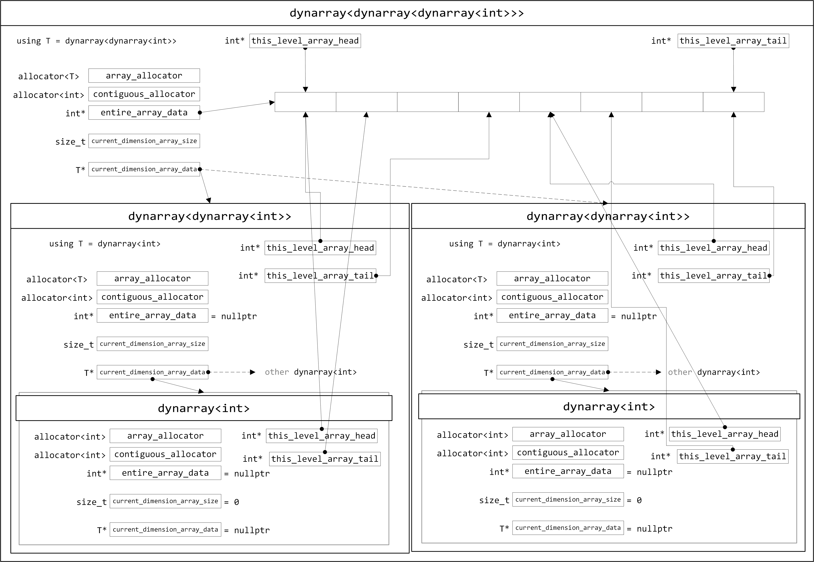
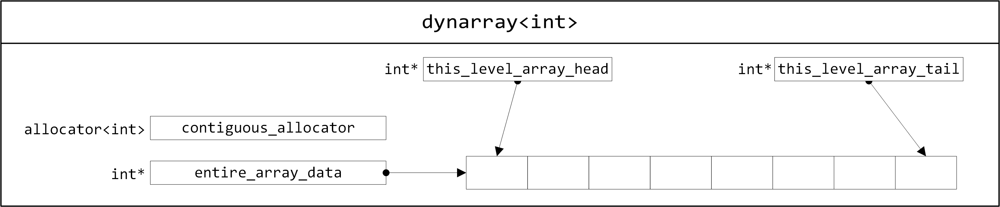
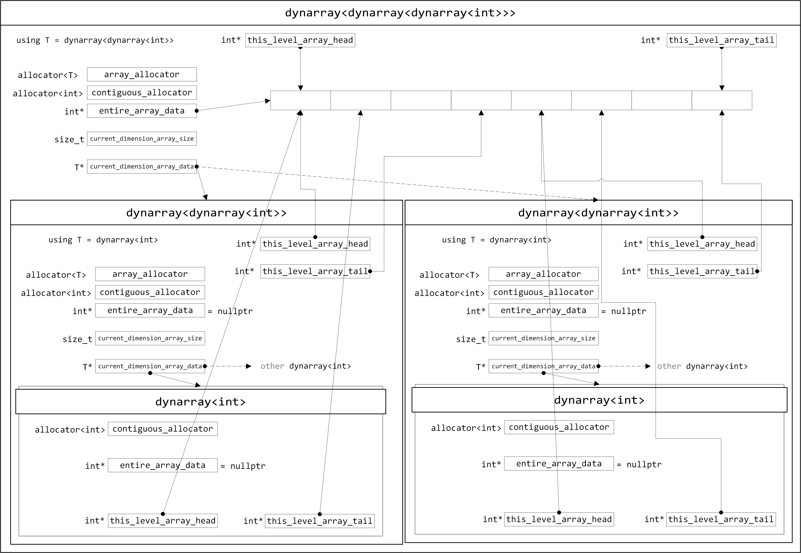
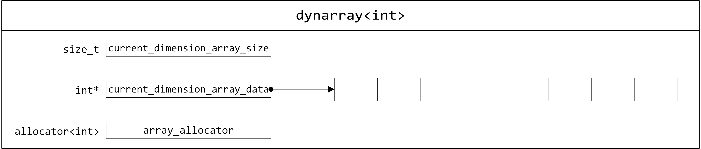
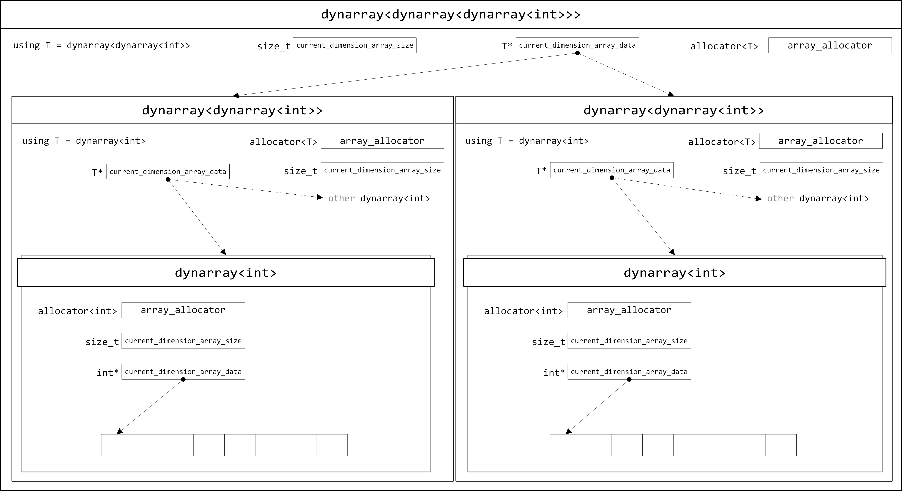

# VLA for C++: dynarray
[English Version](README.md)
[繁中版介紹在這裏](README_zh_HK.md)

这是个 header-only 的库，为 C++ 提供 C99 VLA 的类似用法。不必在 C++ 中使用编译器提供的 VLA 扩展功能。

## 依赖项

C++ 14 或 17

C++ 标准库

# 项目目的

C 语言自 C99 开始提供了 VLA，这是我最喜欢的 C 语言特性。C++ 曾经也有类似的库进入 C++14 标准：[N3662](http://www.open-std.org/jtc1/sc22/wg21/docs/papers/2013/n3662.html)，只不过很快就消失了。C++14 后再有提案[P0785R0](http://www.open-std.org/jtc1/sc22/wg21/docs/papers/2017/p0785r0.html)，但仍未成为标准的一部分。

VLA 最大的特点是，可以在连续的内存空间内使用动态定义的数组（多维数组也是这样），并且定义后该数组长度不变。`vector` 虽然可以做到相似的功能，例如使用自定义的 `allocator` 连续分配空间，但是对数组长度不再改变就没什么好办法，只能写个提醒告知后续使用者不要用 `push_back` 或 `emplace_back`。

由于 `std:dynarray` 已经在C++14成为标准前删除了，所以这里我做了一个 `std::dynarray` 的扩充版本，为它提供多维数组（嵌套数组）功能。修改后的 `dynarray` 介于 VLA 和 `vector` 之间，既能保持像那样 VLA 连续分配空间，也能保持像 `vector` 那样使用 C++ 迭代器。

# 文件说明	

## `Doxyfile`	

用于 doxygen 创建说明文档	

## `dynarray.hpp`	

原型版本，全局通用结构，占用内存相对较多。需要 C++17。	

## `vla/dynarray.hpp`	

模板特化过的版本，占用内存中等。只需 C++14。	

## `vla/dynarray_lite.hpp`	

极小化版本，不保证向多维数组提供连续的内存空间。需要 C++17。	

## `vla/dynarray_mini.hpp`	

`dynarray` 内部使用 `std::unique_ptr<[]>`，不保证向多维数组提供连续的内存空间，无法使用自定义分配器。需要 C++17。	

# 版本对比	

| 版本描述                        | 原型版本         | 模板偏特化            | Lite 版本                | Mini 版本                |	
| --------------------------- | ------------ | ---------------- | ---------------------- | ---------------------- |	
| 文件<sup>1</sup>                           | dynarray.hpp | vla/dynarray.hpp | vla/dynarray\_lite.hpp | vla/dynarray\_mini.hpp |	
| C++需求                       | C++17        | C++14            | C++17                  | C++17                  |	
| sizeof dynarray (最外层<sup>2</sup>)  | 48 bytes     | 48 bytes         | 24 bytes               | 16 bytes               |	
| sizeof dynarray (中层每个节点<sup>2</sup>)  | 48 bytes     | 48 bytes         | 24 bytes               | 16 bytes               |	
| sizeof dynarray (最内层每个节点<sup>2</sup>)| 48 bytes     | 32 bytes         | 24 bytes               | 16 bytes               |	
| sizeof dynarray (一维数组)| 48 bytes     | 32 bytes         | 24 bytes               | 16 bytes               |	
| 多维数组连续内存                    | 是            | 是                | 否                      | 否                      |	
| 可以使用自定义分配器                | 是            | 是                | 是                      | 否                      |	

<sup>1</sup> 请只使用其中一个 `.hpp` 文件。请勿全部都用。	

<sup>2</sup> 多维数组	

# 使用方法

```C++
#include <iostream>
#include "dynarray.hpp"

int main()
{
    int x = 100, y = 200;
    int value = 5;
    vla::dynarray<vla::dynarray<int>> vla_array(x, y, value);
    std::cout << vla_array[8][16] << std::endl;    // 5
    vla_array[8][16] = 20;
    std::cout << vla_array[8][16] << std::endl;    // 20
}
```

## 创建一维数组

1. 用变量大小创建数组
```C++
int count = 100;
vla::dynarray<int> vla_array(count); 
```
相当于
```C
int count = 100;
int vla_array[count];
memset(vla_array, 0, sizeof vla_array);
```

2. 创建数组时指定初始值
```C++
int count = 100;
vla::dynarray<int> vla_array(count, 256); 
```
相当于
```C
int count = 100;
int vla_array[count];
memset(vla_array, 256, sizeof vla_array);
```

3. 创建零大小数组
```C++
vla::dynarray<int> vla_array;
```
或
```C++
vla::dynarray<int> vla_array(0); 
```

4. 用另一个数组初始化或者替换当前数组
```C++
vla::dynarray<int> vla_array(vla::dynarray<int>(100, 256));
```
```C++
vla::dynarray<int> vla_array_a(100);
vla::dynarray<int> vla_array_b(vla_array_a);
```
```C++
vla::dynarray<int> vla_array_a(100);
vla::dynarray<int> vla_array_b;
vla_array_b = vla_array_a;
```

5. 使用初始化列表
```C++
vla::dynarray<int> vla_array = {2, 4, 8, 16};
```
```C++
vla::dynarray<int> vla_array;
vla_array = {2, 4, 8, 16};
```

6. 使用迭代器
```C++
int raw_array[100] = {};
vla::dynarray<int> vla_array(std::begin(raw_array), std::end(raw_array));
```
```C++
vla::dynarray<int> vla_array_a(100);
vla::dynarray<int> vla_array_b(vla_array_a.begin() + 20, vla_array_a.end());
```

## 创建二维数组
1. 用变量大小创建数组
```C++
int x = 100, y = 200;
vla::dynarray<vla::dynarray<int>> vla_array(x, y); 
```
相当于
```C
int x = 100, y = 200;
int vla_array[x][y];
memset(vla_array, 0, sizeof vla_array);
```

2. 创建数组时指定初始值
```C++
int x = 100, y = 200;
vla::dynarray<vla::dynarray<int>> vla_array(x, y, 256); // 初始值256
```
相当于
```C
int x = 100, y = 200;
int vla_array[x][y];
memset(vla_array, 256, sizeof vla_array);
```

3. 创建零大小数组

只要给出的参数个数少于实际维度，或者维度参数中其中一个为零，都可以创建零大小数组

```C++
vla::dynarray<vla::dynarray<int>> vla_array;
```
或
```C++
vla::dynarray<vla::dynarray<int>> vla_array(0); 
```
或
```C++
vla::dynarray<vla::dynarray<int>> vla_array(30, 0); 
```
或
```C++
vla::dynarray<vla::dynarray<int>> vla_array(0, 5); 
```

4. 用另一个数组初始化或者替换当前数组
```C++
vla::dynarray<vla::dynarray<int>> vla_array(vla::dynarray<vla::dynarray<int>>(100, 200));
```
```C++
vla::dynarray<vla::dynarray<int>> vla_array_a(100, 300);
vla::dynarray<vla::dynarray<int>> vla_array_b(vla_array_a);
```
```C++
vla::dynarray<vla::dynarray<int>> vla_array_a(100, 200, 10);
vla::dynarray<vla::dynarray<int>> vla_array_b(100, 200);
vla_array_b = vla_array_a;	// all elements of vla_array_b have value 10
```

5. 使用初始化列表
	- 创建 3 × 3 数组
	```C++
	vla::dynarray<vla::dynarray<int>> array33 = { {1, 2, 3 }, {3, 2, 1}, {2, 4, 6} };
	```
	- 创建 3 × 3 数组
	```C++
	vla::dynarray<vla::dynarray<int>> array33;
	array33 = { {1, 2, 3 }, {3, 2, 1}, {2, 4, 6} };
	```
	- 创建不定长度大小数组
	```C++
	vla::dynarray<vla::dynarray<int>> vla_array = { {10, 100, 1000}, {1, 3, 5}, {0, 3} };
	```
	在这个例子中

	`vla_array.size() == 3`

	`vla_array[0].size() == 3`

	`vla_array[1].size() == 3`

	`vla_array[2].size() == 2`


6. 使用迭代器

	使用方法类似于一维数组，此处举例省略。

## 创建多维数组

类似于创建二维数组，此处省略。

再次提醒，只要给出的参数个数少于实际维度，或者维度参数中其中一个为零，就会创造出零大小数组。

以下均为零大小数组：

```C++
vla::dynarray<vla::dynarray<vla::dynarray<int>>> vla_array;
vla::dynarray<vla::dynarray<vla::dynarray<int>>> vla_array_a(100);
vla::dynarray<vla::dynarray<vla::dynarray<int>>> vla_array_b(vla_array_a);
vla::dynarray<vla::dynarray<vla::dynarray<int>>> vla_array_c(100, 200);
```

## 使用自定义分配器

`vla::dynarray` 默认使用 `std::allocator`。如果希望 `vla::dynarray` 在栈上分配，那么就需要您自己写一个分配器。

`vla::dynarray` 的分配器用法稍稍不同于标准库的容器。

例如你有一个分配器如下

```C++
template<typename T>
class your_allocator { /* ...... */ };
```

对于标准库容器，使用起来是这样的，尖括号内传递 `your_allocator<T>`

```C++
your_allocator<int> my_alloc(/* sth */);
std::vector<int, your_allocator<int>> my_vec(100, my_alloc);
```

但 `vla::dynarray` 用起来不一样，尖括号内传递模板名 `your_allocator`
```C++
your_allocator<int> my_alloc(/* sth */);
vla::dynarray<int, your_allocator> my_array(100, my_alloc);
```

多维数组会比较繁琐

```C++
your_allocator<int> my_alloc(/* sth */);
your_allocator<vla::dynarray<int, your_allocator>> my_alloc_2(/* sth */);

vla::dynarray<vla::dynarray<int, your_allocator>, your_allocator> my_array(200, my_alloc_2,
                                                                           100, my_alloc);

vla::dynarray<vla::dynarray<int, your_allocator>, your_allocator> another_array(my_array, my_alloc_2, my_alloc);
```

也可以直接这样来：	

```C++	
template<typename T>	
class your_allocator { /* ...... */ };	
vla::dynarray<int, your_allocator> my_array_1(200);	
vla::dynarray<vla::dynarray<int, your_allocator>, your_allocator> my_array_2(200, 100);	
vla::dynarray<vla::dynarray<int, your_allocator>, your_allocator> another_array(my_array_2);	
```

注意事项：所有分配器来源都必须相同，否则会无法编译。以下是**错误例子**

```C++
std::allocator<int> std_alloc(/* sth */);
your_allocator<vla::dynarray<int, std::allocator>> my_alloc_2(/* sth */);

// cannot compile
vla::dynarray<vla::dynarray<int, std::allocator>, your_allocator> my_array(200, my_alloc_2,
                                                                           100, std_alloc);
```

## `operator=` 的行为

对 `vla::dynarray` 使用 `operator=` 只会对底层数据做赋值操作，不改变 size。

1. 如果等号两侧的数组存在零大小数组，那么 `operator=` 不会做任何事情。


```C++
vla::dynarray<int> vla_array;
vla::dynarray<int> vla_array_2(5, 10);
vla_array = vla_array_2;	// do nothing
```

2. 如果等号右侧数组的大小比左侧的小，那么就会只填充左侧数组的部分元素。

* 示例1

```C++
vla::dynarray<vla::dynarray<int>> vla_array(6, 6);
vla::dynarray<vla::dynarray<int>> vla_array_2(3, 3, 5);
```

|vla_array|[x][0]|[x][1]|[x][2]|[x][3]|[x][4]|[x][5]|
| - | - | - | - | - | - | - |
|[0][y]| 0 | 0 | 0 | 0 | 0 | 0 |
|[1][y]| 0 | 0 | 0 | 0 | 0 | 0 |
|[2][y]| 0 | 0 | 0 | 0 | 0 | 0 |
|[3][y]| 0 | 0 | 0 | 0 | 0 | 0 |
|[4][y]| 0 | 0 | 0 | 0 | 0 | 0 |
|[5][y]| 0 | 0 | 0 | 0 | 0 | 0 |

|vla_array_2|[x][0]|[x][1]|[x][2]|
| - | - | - | - |
|[0][y]| 5 | 5 | 5 |
|[1][y]| 5 | 5 | 5 |
|[2][y]| 5 | 5 | 5 |

***
```C++
vla_array = vla_array_2;
```

|vla_array|[x][0]|[x][1]|[x][2]|[x][3]|[x][4]|[x][5]|
| - | - | - | - | - | - | - |
|[0][y]| 5 | 5 | 5 | 0 | 0 | 0 |
|[1][y]| 5 | 5 | 5 | 0 | 0 | 0 |
|[2][y]| 5 | 5 | 5 | 0 | 0 | 0 |
|[3][y]| 0 | 0 | 0 | 0 | 0 | 0 |
|[4][y]| 0 | 0 | 0 | 0 | 0 | 0 |
|[5][y]| 0 | 0 | 0 | 0 | 0 | 0 |

***

* 示例2

```C++
vla::dynarray<vla::dynarray<int>> vla_array(6, 6);
vla::dynarray<vla::dynarray<int>> vla_array_2(3, 3, 5);
```

|vla_array|[x][0]|[x][1]|[x][2]|[x][3]|[x][4]|[x][5]|
| - | - | - | - | - | - | - |
|[0][y]| 0 | 0 | 0 | 0 | 0 | 0 |
|[1][y]| 0 | 0 | 0 | 0 | 0 | 0 |
|[2][y]| 0 | 0 | 0 | 0 | 0 | 0 |
|[3][y]| 0 | 0 | 0 | 0 | 0 | 0 |
|[4][y]| 0 | 0 | 0 | 0 | 0 | 0 |
|[5][y]| 0 | 0 | 0 | 0 | 0 | 0 |

|vla_array_2|[x][0]|[x][1]|[x][2]|
| - | - | - | - |
|[0][y]| 5 | 5 | 5 |
|[1][y]| 5 | 5 | 5 |
|[2][y]| 5 | 5 | 5 |

***
```C++
vla_array[2] = vla_array_2[2];
```

|vla_array|[x][0]|[x][1]|[x][2]|[x][3]|[x][4]|[x][5]|
| - | - | - | - | - | - | - |
|[0][y]| 0 | 0 | 0 | 0 | 0 | 0 |
|[1][y]| 0 | 0 | 0 | 0 | 0 | 0 |
|[2][y]| 5 | 5 | 5 | 0 | 0 | 0 |
|[3][y]| 0 | 0 | 0 | 0 | 0 | 0 |
|[4][y]| 0 | 0 | 0 | 0 | 0 | 0 |
|[5][y]| 0 | 0 | 0 | 0 | 0 | 0 |

***
```C++
vla_array_2[0] = vla_array[0];
```

|vla_array_2|[x][0]|[x][1]|[x][2]|
| - | - | - | - |
|[0][y]| 0 | 0 | 0 |
|[1][y]| 5 | 5 | 5 |
|[2][y]| 5 | 5 | 5 |

## 其它接口
1. `at(n)`
	```C++
	vla::dynarray<int> vla_array(5, 10);
	int number = vla_array.at(2);
	```

2. `[]`
	```C++
	vla::dynarray<vla::dynarray<int>> vla_array(5, 5, 10);
	int number = vla_array[2][2];
	```

3. `front()`
	```C++
	vla::dynarray<int> vla_array(5, 10);
	int number = vla_array.front();
	```

4. `back()`
	```C++
	vla::dynarray<int> vla_array(5, 10);
	int number = vla_array.back();
	```

5. `data()`
	```C++
	vla::dynarray<int> vla_array(5, 10);
	int *raw_array = vla_array.data();
	```
	即使是多维数组，`data()`获得的依然是单层指针，指向一片连续的内存空间
	```C++
	vla::dynarray<vla::dynarray<int>> vla_array(5, 5, 10);
	int *raw_array = vla_array.data();
	```

6. `get()`
	```C++
	vla::dynarray<vla::dynarray<int>> vla_array(5, 5, 10);
	vla::dynarray<int> *raw_array = vla_array.get();
	```

7. `empty()`
	```C++
	vla::dynarray<int> vla_array(5, 10);
	bool is_empty = vla_array.empty();  // is_empty == false
	```

8. `size()`
	```C++
	vla::dynarray<int> vla_array(5, 10);
	std::size_t array_size = vla_array.size();  // array_size == 5
	```

9. `max_size()`

	dynarray 最大承载量

	```C++
	vla::dynarray<int> vla_array(5, 10);
	std::size_t max_size = vla_array.max_size();  // std::numeric_limits<std::ptrdiff_t>::max()
	```

10. `swap()`
	
	仅交换内部值，不交换 `dynarray` 本身
	
	```C++
	vla::dynarray<vla::dynarray<int>> vla_array_a(6, 6, 1);
	vla::dynarray<vla::dynarray<int>> vla_array_b(3, 3, 5);
	```
	|vla_array_a|[x][0]|[x][1]|[x][2]|[x][3]|[x][4]|[x][5]|
	| - | - | - | - | - | - | - |
	|[0][y]| 1 | 1 | 1 | 1 | 1 | 1 |
	|[1][y]| 1 | 1 | 1 | 1 | 1 | 1 |
	|[2][y]| 1 | 1 | 1 | 1 | 1 | 1 |
	|[3][y]| 1 | 1 | 1 | 1 | 1 | 1 |
	|[4][y]| 1 | 1 | 1 | 1 | 1 | 1 |
	|[5][y]| 1 | 1 | 1 | 1 | 1 | 1 |

	|vla_array_b|[x][0]|[x][1]|[x][2]|
	| - | - | - | - |
	|[0][y]| 5 | 5 | 5 |
	|[1][y]| 5 | 5 | 5 |
	|[2][y]| 5 | 5 | 5 |

	***
	```C++
	vla_array_a.swap(vla_array_b);
	```

	|vla_array_a|[x][0]|[x][1]|[x][2]|[x][3]|[x][4]|[x][5]|
	| - | - | - | - | - | - | - |
	|[0][y]| 5 | 5 | 5 | 1 | 1 | 1 |
	|[1][y]| 5 | 5 | 5 | 1 | 1 | 1 |
	|[2][y]| 5 | 5 | 5 | 1 | 1 | 1 |
	|[3][y]| 1 | 1 | 1 | 1 | 1 | 1 |
	|[4][y]| 1 | 1 | 1 | 1 | 1 | 1 |
	|[5][y]| 1 | 1 | 1 | 1 | 1 | 1 |

	|vla_array_b|[x][0]|[x][1]|[x][2]|
	| - | - | - | - |
	|[0][y]| 1 | 1 | 1 |
	|[1][y]| 1 | 1 | 1 |
	|[2][y]| 1 | 1 | 1 |

11. `fill()`
	```C++
	vla::dynarray<int> vla_array(100);
	vla_array.fill(256);	// all elements have value 256
	```
	```C++
	vla::dynarray<vla::dynarray<int>> vla_array(100, 100);
	vla_array.fill(256);	// all elements in all dimension have value 256
	```

## 迭代器
* begin()
* cbegin()
* end()
* cend()
* rbegin()
* crbegin()
* rend()
* crend()


# 内部设计

## 原型版本

对于多层 dynarray，先由最外层 dynarray 在内存中分配一块连续的数组空间，大小由用户提供。然后再分配内部 dynarray 管理节点，这些内部各 dynarray 拥有头尾指针，按照顺序、大小指向正确的位置。

单层 dynarray 是多层 dynarray 的简化版。




## `vla/dynarray.hpp`	

	

	

## `vla/dynarray_lite.hpp`	

	



## 最关键的一行代码

```C++
friend class dynarray<dynarray<T, _Allocator>, _Allocator>;
```

极为简单，真的就一行，毫无神秘感。

这样就可以使得外层 dynarray 可以访问内层 dynarray 内的任意数据，包括私有成员。

外部用户照样无法访问私有成员。

# License

在此存储库中使用的代码均遵循 [BSD-3-Clause License](LICENSE)
