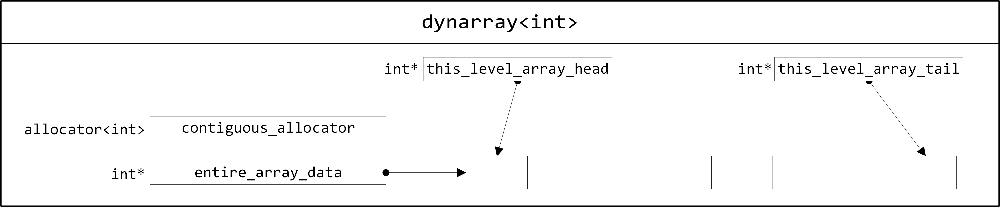
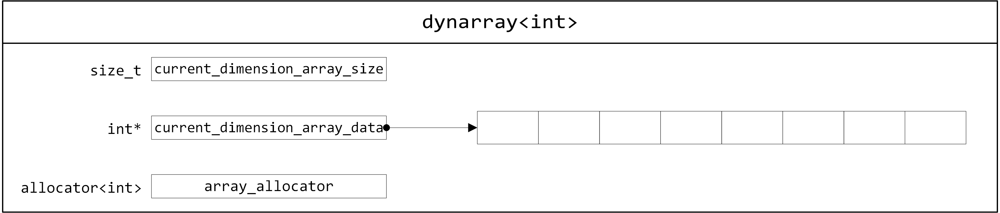
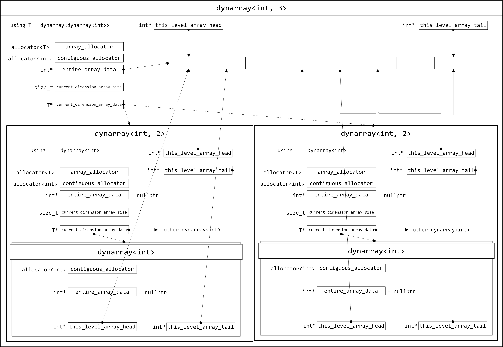

# VLA for C++: dynarray

[English Version](README.md)

[简中版介绍在这里](README_zh_CN.md)

這是個 header-only 的庫，爲 C++ 提供 C99 VLA 的類似用法。不必在 C++ 中使用編譯器提供的 VLA 擴展功能。

## 依賴項

C++ 14 或 17

C++ 標準庫

# 項目目的

C 語言自 C99 開始提供了 VLA，這是我最喜歡的 C 語言特性。C++ 曾經亦有類似的庫進入 C++14 標準：[N3662](http://www.open-std.org/jtc1/sc22/wg21/docs/papers/2013/n3662.html)，祇不過很快就消失了。C++14 後再有提案[P0785R0](http://www.open-std.org/jtc1/sc22/wg21/docs/papers/2017/p0785r0.html)，但仍未成爲標準的一部分。

VLA 最大的特點是，可以在連續的記憶體空間內使用動態定義的數組（多維數組亦是這樣），並且定義後該數組長度不變。`vector` 雖然可以做到相似的功能，例如使用自訂的 `allocator` 連續分配空間，但是對數組長度不再改變就沒甚麼好辦法，祇能寫個提醒告知後續使用者不要用 `push_back` 或 `emplace_back`。

由於 `std:dynarray` 已經在C++14成爲標準前刪除了，所以這裡我做了一個 `std::dynarray` 的擴充版本，爲其提供多維數組（嵌套數組）功能。修改後的 `dynarray` 介於 VLA 和 `vector` 之間，既能保持像那樣 VLA 連續分配空間，亦能保持類似 `vector` 那樣使用 C++ 疊代器。

# 檔案說明

## `Doxyfile`

用於 doxygen 創建說明文檔

## `dynarray.hpp`

原型版本，全域通用結構，佔用記憶體空間相對較多。需要 C++17。

## `vla_nest/dynarray.hpp`

模板特化過的版本，佔用記憶體空間中等。祇需 C++14。

## `vla_nest/dynarray_lite.hpp`

極小化版本，不保證向多維數組提供連續的記憶體空間。需要 C++17。

## `vla_nest/dynarray_mini.hpp`

`dynarray` 內部使用 `std::unique_ptr<[]>`，不保證向多維數組提供連續的記憶體空間,無法使用自訂分配器。需要 C++17。

## `vla_cleanlily/dynarray.hpp`

乾淨企理版，外觀上非嵌套版本（內部實作仍然嵌套）。使用方式不同於上述幾個。需要C++17。

# 版本对比

| 版本描述    | 檔案<sup>1</sup>               | C++需求 | sizeof dynarray<sup>2</sup> (最外層；中層每個節點<sup>3</sup>) | sizeof dynarray<sup>2</sup> (最內層每個節點<sup>3</sup>) | sizeof dynarray<sup>2</sup> (一維數組) | 多維數組連續記憶體空間 | 可以使用自訂分配器 |
| ------- | ---------------------------- | ----- | ---------------------------------------------------- | ------------------------------------------------- | ---------------------------------- | ----------- | --------- |
| 原型版本    | dynarray.hpp                 | C++17 | 48 bytes                                             | 48 bytes                                          | 48 bytes                           | 是           | 是         |
| 模板偏特化   | vla\_nest/dynarray.hpp       | C++14 | 48 bytes                                             | 32 bytes                                          | 32 bytes                           | 是           | 是         |
| Lite 版本 | vla\_nest/dynarray\_lite.hpp | C++17 | 24 bytes                                             | 24 bytes                                          | 24 bytes                           | 否           | 是         |
| Mini 版本 | vla\_nest/dynarray\_mini.hpp | C++17 | 16 bytes                                             | 16 bytes                                          | 16 bytes                           | 否           | 否         |
| 乾淨企理版   | vla\_cleanlily/dynarray.hpp  | C++17 | 48 bytes                                             | 32 bytes                                          | 32 bytes                           | 是           | 是         |

<sup>1</sup> 請祇使用其中一個 `.hpp` 檔案。請勿全部都用。

<sup>2</sup> 對齊後

<sup>3</sup> 多維數組

# 使用方法

原型版本及各种“嵌套”外觀版本：

```C++
#include <iostream>
#include "dynarray.hpp"

int main()
{
    int x = 100, y = 200;
    int value = 5;
    vla::dynarray<vla::dynarray<int>> vla_array(x, y, value);
    std::cout << vla_array[8][16] << std::endl;    // 5
    vla_array[8][16] = 20;
    std::cout << vla_array[8][16] << std::endl;    // 20
}
```

乾淨企理版：

```C++
#include <iostream>
#include "dynarray.hpp"

int main()
{
    int x = 100, y = 200;
    int value = 5;
    vla::dynarray<int, 2> vla_array(x, y, value);
    std::cout << vla_array[8][16] << std::endl;    // 5
    vla_array[8][16] = 20;
    std::cout << vla_array[8][16] << std::endl;    // 20
}
```

## 創建一維數組

1. 用變量大小創建數組
```C++
int count = 100;
vla::dynarray<int> vla_array(count); 
```
相當於
```C
int count = 100;
int vla_array[count];
memset(vla_array, 0, sizeof vla_array);
```

對於乾淨企理版本，可以寫

```C++
int count = 100;
vla::dynarray<int> vla_array(count);
vla::dynarray<int, 1> vla_array_other(count);
```

2. 創建數組時指定初始值
```C++
int count = 100;
vla::dynarray<int> vla_array(count, 256); 
```
相當於
```C
int count = 100;
int vla_array[count];
memset(vla_array, 256, sizeof vla_array);
```

3. 創建零大小數組

```C++
vla::dynarray<int> vla_array;
```

或

```C++
vla::dynarray<int> vla_array(0); 
```

或（僅限乾淨企理版）

```C++
vla::dynarray<int, 0> vla_array;
```

4. 用另一個數組初始化或者替換當前數組
```C++
vla::dynarray<int> vla_array(vla::dynarray<int>(100, 256));
```
```C++
vla::dynarray<int> vla_array_a(100);
vla::dynarray<int> vla_array_b(vla_array_a);
```
```C++
vla::dynarray<int> vla_array_a(100);
vla::dynarray<int> vla_array_b;
vla_array_b = vla_array_a;
```

5. 使用初始化列表
```C++
vla::dynarray<int> vla_array = {2, 4, 8, 16};
```
```C++
vla::dynarray<int> vla_array;
vla_array = {2, 4, 8, 16};
```

6. 使用疊代器
```C++
int raw_array[100] = {};
vla::dynarray<int> vla_array(std::begin(raw_array), std::end(raw_array));
```
```C++
vla::dynarray<int> vla_array_a(100);
vla::dynarray<int> vla_array_b(vla_array_a.begin() + 20, vla_array_a.end());
```

## 創建二維數組

嵌套版：

1. 用變量大小創建數組
```C++
int x = 100, y = 200;
vla::dynarray<vla::dynarray<int>> vla_array(x, y); 
```

相當於

```C
int x = 100, y = 200;
int vla_array[x][y];
memset(vla_array, 0, sizeof vla_array);
```

乾淨企理版：

```C++
int x = 100, y = 200;
vla::dynarray<int, 2> vla_array(x, y); 
```

2. 創建數組時指定初始值

嵌套版：

```C++
int x = 100, y = 200;
vla::dynarray<vla::dynarray<int>> vla_array(x, y, 256); // 初始值256
```

相當於

```C
int x = 100, y = 200;
int vla_array[x][y];
memset(vla_array, 256, sizeof vla_array);
```

乾淨企理版：

```C++
int x = 100, y = 200;
vla::dynarray<int, 2> vla_array(x, y, 256); 
```

3. 創建零大小數組

祇要給出的參數個數少於實際維度，或者維度參數中其中一個爲零，都可以創建零大小數組

嵌套版：

```C++
vla::dynarray<vla::dynarray<int>> vla_array;
```
或
```C++
vla::dynarray<vla::dynarray<int>> vla_array(0); 
```
或
```C++
vla::dynarray<vla::dynarray<int>> vla_array(30, 0); 
```
或
```C++
vla::dynarray<vla::dynarray<int>> vla_array(0, 5); 
```

乾淨企理版：

```C++
vla::dynarray<int, 2> vla_array;
```
或
```C++
vla::dynarray<int, 2> vla_array(0); 
```
或
```C++
vla::dynarray<int, 2> vla_array(30, 0); 
```
或
```C++
vla::dynarray<int, 2> vla_array(0, 5); 
```

4. 用另一個數組初始化或者替换當前數組

嵌套版：

```C++
vla::dynarray<vla::dynarray<int>> vla_array(vla::dynarray<vla::dynarray<int>>(100, 200));
```
```C++
vla::dynarray<vla::dynarray<int>> vla_array_a(100, 300);
vla::dynarray<vla::dynarray<int>> vla_array_b(vla_array_a);
```
```C++
vla::dynarray<vla::dynarray<int>> vla_array_a(100, 200, 10);
vla::dynarray<vla::dynarray<int>> vla_array_b(100, 200);
vla_array_b = vla_array_a;	// all elements of vla_array_b have value 10
```

乾淨企理版：

```C++
vla::dynarray<int, 2> vla_array(vla::dynarray<int, 2>(100, 200));
```
```C++
vla::dynarray<int, 2> vla_array_a(100, 300);
vla::dynarray<int, 2> vla_array_b(vla_array_a);
```
```C++
vla::dynarray<int, 2> vla_array_a(100, 200, 10);
vla::dynarray<int, 2> vla_array_b(100, 200);
vla_array_b = vla_array_a;	// all elements of vla_array_b have value 10
```

5. 使用初始化列表

	嵌套版：

	- 創建 3 × 3 數組
	```C++
	vla::dynarray<vla::dynarray<int>> array33 = { {1, 2, 3 }, {3, 2, 1}, {2, 4, 6} };
	```
	- 創建 3 × 3 數組
	```C++
	vla::dynarray<vla::dynarray<int>> array33;
	array33 = { {1, 2, 3 }, {3, 2, 1}, {2, 4, 6} };
	```
	或（不適用於 `dynarray_lite.hpp` 以及 `dynarray_mini.hpp`）
	```C++
	vla::dynarray<vla::dynarray<int>> array33(3, 3);
	array33 = { 1, 2, 3, 3, 2, 1, 2, 4, 6 };	// 如同 C-style array
	```
	- 創建不定長度大小數組
	```C++
	vla::dynarray<vla::dynarray<int>> vla_array = { {10, 100, 1000}, {1, 3, 5}, {0, 3} };
	```

	乾淨企理版：

	- 創建 3 × 3 數組
	```C++
	vla::dynarray<int, 2> array33 = { {1, 2, 3 }, {3, 2, 1}, {2, 4, 6} };
	```
	- 創建 3 × 3 數組
	```C++
	vla::dynarray<int, 2> array33(3, 3);
	array33 = { {1, 2, 3 }, {3, 2, 1}, {2, 4, 6} };
	```
	或
	```C++
	vla::dynarray<int, 2> array33(3, 3);
	array33 = { 1, 2, 3, 3, 2, 1, 2, 4, 6 };	// 如同 C-style array
	```
	- 創建不定長度大小數組
	```C++
	vla::dynarray<int, 2> vla_array = { {10, 100, 1000}, {1, 3, 5}, {0, 3} };
	```

	在這個例子中

	`vla_array.size() == 3`

	`vla_array[0].size() == 3`

	`vla_array[1].size() == 3`

	`vla_array[2].size() == 2`


6. 使用疊代器

	使用方法類似於一維數組，此處舉例省略。

## 創建多維數組

類似於創建二維數組，此處省略。

再次提醒，祇要給出的參數個數少於實際維度，或者維度參數中其中一個爲零，就會創造出零大小數組。

以下均爲零大小數組：

嵌套版：

```C++
vla::dynarray<vla::dynarray<vla::dynarray<int>>> vla_array;
vla::dynarray<vla::dynarray<vla::dynarray<int>>> vla_array_a(100);
vla::dynarray<vla::dynarray<vla::dynarray<int>>> vla_array_b(vla_array_a);
vla::dynarray<vla::dynarray<vla::dynarray<int>>> vla_array_c(100, 200);
```

乾淨企理版：

```C++
vla::dynarray<int, 3> vla_array;
vla::dynarray<int, 3> vla_array_a(100);
vla::dynarray<int, 3> vla_array_b(vla_array_a);
vla::dynarray<int, 3> vla_array_c(100, 200);
```

## 使用自訂分配器

`vla::dynarray` 預設使用 `std::allocator`。如果希望 `vla::dynarray` 在棧上分配，那麼就需要您自己寫一個分配器。

`vla::dynarray` 的分配器用法稍稍不同於標準庫的容器。

例如你有一個分配器如下

```C++
template<typename T>
class your_allocator { /* ...... */ };
```

對於標準庫容器，使用起來是這樣的，尖括號內傳遞 `your_allocator<T>`

```C++
your_allocator<int> my_alloc(/* sth */);
std::vector<int, your_allocator<int>> my_vec(100, my_alloc);
```

但 `vla::dynarray` 用起來不一樣，尖括號內傳遞模板名 `your_allocator`

嵌套版：

```C++
your_allocator<int> my_alloc(/* sth */);
vla::dynarray<int, your_allocator> my_array(100, my_alloc);
```

乾淨企理版：

```C++
your_allocator<int> my_alloc(/* sth */);
vla::dynarray<int, 1, your_allocator> my_array(100, my_alloc);
```

嵌套版多維數組會比較繁瑣

```C++
your_allocator<int> my_alloc(/* sth */);
your_allocator<vla::dynarray<int, your_allocator>> my_alloc_2(/* sth */);

vla::dynarray<vla::dynarray<int, your_allocator>, your_allocator> my_array(200, my_alloc_2,
                                                                           100, my_alloc);

vla::dynarray<vla::dynarray<int, your_allocator>, your_allocator> another_array(my_array, my_alloc_2, my_alloc);
```

乾淨企理版就好得多

```C++
your_allocator<int> my_alloc(/* sth */);
your_allocator<vla::dynarray<int, 1, your_allocator>> my_alloc_2(/* sth */);

vla::dynarray<int, 2, your_allocator> my_array(200, my_alloc_2,
                                               100, my_alloc);

vla::dynarray<int, 2, your_allocator> another_array(my_array, my_alloc_2, my_alloc);
```

亦可以直接這樣來；

嵌套版：

```C++
template<typename T>
class your_allocator { /* ...... */ };

vla::dynarray<int, your_allocator> my_array_1(200);
vla::dynarray<vla::dynarray<int, your_allocator>, your_allocator> my_array_2(200, 100);
vla::dynarray<vla::dynarray<int, your_allocator>, your_allocator> another_array(my_array_2);
```

乾淨企理版：

```C++
vla::dynarray<int, 1, your_allocator> my_array_1(200);
vla::dynarray<int, 2, your_allocator> my_array_2(200, 100);
vla::dynarray<int, 2, your_allocator> another_array(my_array_2);
```

注意事項：所有分配器來源都必須相同，否則會無法編譯。以下是**錯誤例子**

嵌套版：

```C++
std::allocator<int> std_alloc(/* sth */);
your_allocator<vla::dynarray<int, std::allocator>> my_alloc_2(/* sth */);

// cannot compile
vla::dynarray<vla::dynarray<int, std::allocator>, your_allocator> my_array(200, my_alloc_2,
                                                                           100, std_alloc);
```

乾淨企理版：

```C++
std::allocator<int> std_alloc(/* sth */);
your_allocator<vla::dynarray<int, 1, std::allocator>> my_alloc_2(/* sth */);

// cannot compile
vla::dynarray<int, 2, std::allocator> my_array(200, my_alloc_2,
                                               100, std_alloc);
```

## `operator=` 的行爲

對 `vla::dynarray` 使用 `operator=` 祇會對底層數據做賦值操作，不改變 size。

1. 如果等號两側的數組存在零大小數組，那麼 `operator=` 不會做任何事情。

```C++
vla::dynarray<int> vla_array;
vla::dynarray<int> vla_array_2(5, 10);
vla_array = vla_array_2;	// vla_array becomes a copy of vla_array_2
```

2. 如果等號右側數組的大小比左側的小，那麼就會祇填充左側數組的部分元素。

* 示例1

嵌套版：

```C++
vla::dynarray<vla::dynarray<int>> vla_array(6, 6);
vla::dynarray<vla::dynarray<int>> vla_array_2(3, 3, 5);
```

乾淨企理版：

```C++
vla::dynarray<int, 2> vla_array(6, 6);
vla::dynarray<int, 2> vla_array_2(3, 3, 5);
```

|vla_array|[x][0]|[x][1]|[x][2]|[x][3]|[x][4]|[x][5]|
| :-: | :-: | :-: | :-: | :-: | :-: | :-: |
|**[0][y]**| 0 | 0 | 0 | 0 | 0 | 0 |
|**[1][y]**| 0 | 0 | 0 | 0 | 0 | 0 |
|**[2][y]**| 0 | 0 | 0 | 0 | 0 | 0 |
|**[3][y]**| 0 | 0 | 0 | 0 | 0 | 0 |
|**[4][y]**| 0 | 0 | 0 | 0 | 0 | 0 |
|**[5][y]**| 0 | 0 | 0 | 0 | 0 | 0 |

|vla_array_2|[x][0]|[x][1]|[x][2]|
| :-: | :-: | :-: | :-: |
|**[0][y]**| 5 | 5 | 5 |
|**[1][y]**| 5 | 5 | 5 |
|**[2][y]**| 5 | 5 | 5 |

***
```C++
vla_array = vla_array_2;
```

|vla_array|[x][0]|[x][1]|[x][2]|[x][3]|[x][4]|[x][5]|
| :-: | :-: | :-: | :-: | :-: | :-: | :-: |
|**[0][y]**| 5 | 5 | 5 | 0 | 0 | 0 |
|**[1][y]**| 5 | 5 | 5 | 0 | 0 | 0 |
|**[2][y]**| 5 | 5 | 5 | 0 | 0 | 0 |
|**[3][y]**| 0 | 0 | 0 | 0 | 0 | 0 |
|**[4][y]**| 0 | 0 | 0 | 0 | 0 | 0 |
|**[5][y]**| 0 | 0 | 0 | 0 | 0 | 0 |

***

* 示例2

嵌套版：

```C++
vla::dynarray<vla::dynarray<int>> vla_array(6, 6);
vla::dynarray<vla::dynarray<int>> vla_array_2(3, 3, 5);
```

乾淨企理版：

```C++
vla::dynarray<int, 2> vla_array(6, 6);
vla::dynarray<int, 2> vla_array_2(3, 3, 5);
```

|vla_array|[x][0]|[x][1]|[x][2]|[x][3]|[x][4]|[x][5]|
| :-: | :-: | :-: | :-: | :-: | :-: | :-: |
|**[0][y]**| 0 | 0 | 0 | 0 | 0 | 0 |
|**[1][y]**| 0 | 0 | 0 | 0 | 0 | 0 |
|**[2][y]**| 0 | 0 | 0 | 0 | 0 | 0 |
|**[3][y]**| 0 | 0 | 0 | 0 | 0 | 0 |
|**[4][y]**| 0 | 0 | 0 | 0 | 0 | 0 |
|**[5][y]**| 0 | 0 | 0 | 0 | 0 | 0 |

|vla_array_2|[x][0]|[x][1]|[x][2]|
| :-: | :-: | :-: | :-: |
|**[0][y]**| 5 | 5 | 5 |
|**[1][y]**| 5 | 5 | 5 |
|**[2][y]**| 5 | 5 | 5 |

***
```C++
vla_array[2] = vla_array_2[2];
```

|vla_array|[x][0]|[x][1]|[x][2]|[x][3]|[x][4]|[x][5]|
| :-: | :-: | :-: | :-: | :-: | :-: | :-: |
|**[0][y]**| 0 | 0 | 0 | 0 | 0 | 0 |
|**[1][y]**| 0 | 0 | 0 | 0 | 0 | 0 |
|**[2][y]**| 5 | 5 | 5 | 0 | 0 | 0 |
|**[3][y]**| 0 | 0 | 0 | 0 | 0 | 0 |
|**[4][y]**| 0 | 0 | 0 | 0 | 0 | 0 |
|**[5][y]**| 0 | 0 | 0 | 0 | 0 | 0 |

***
```C++
vla_array_2[0] = vla_array[0];
```

|vla_array_2|[x][0]|[x][1]|[x][2]|
| :-: | :-: | :-: | :-: |
|**[0][y]**| 0 | 0 | 0 |
|**[1][y]**| 5 | 5 | 5 |
|**[2][y]**| 5 | 5 | 5 |

## 其它接口
### 成員函數
1. `at(n)`
	```C++
	vla::dynarray<int> vla_array(5, 10);
	int number = vla_array.at(2);
	```

2. `[]`
	```C++
	vla::dynarray<vla::dynarray<int>> vla_array(5, 5, 10);
	int number = vla_array[2][2];
	```
	或
	```C++
	vla::dynarray<int, 2> vla_array(5, 5, 10);
	int number = vla_array[2][2];
	```

3. `front()`
	```C++
	vla::dynarray<int> vla_array(5, 10);
	int number = vla_array.front();
	```

4. `back()`
	```C++
	vla::dynarray<int> vla_array(5, 10);
	int number = vla_array.back();
	```

5. `data()`
	```C++
	vla::dynarray<int> vla_array(5, 10);
	int *raw_array = vla_array.data();
	```
	即使是多維數組，`data()`獲得的依然是單層指標，指向一片連續的記憶體空間
	```C++
	vla::dynarray<vla::dynarray<int>> vla_array(5, 5, 10);
	int *raw_array = vla_array.data();
	```
	或
	```C++
	vla::dynarray<int, 2> vla_array(5, 5, 10);
	int *raw_array = vla_array.data();
	```

6. `get()`
	```C++
	vla::dynarray<vla::dynarray<int>> vla_array(5, 5, 10);
	vla::dynarray<int> *raw_array = vla_array.get();
	```
	或
	```C++
	vla::dynarray<int, 2> vla_array(5, 5, 10);
	vla::dynarray<int> *raw_array = vla_array.get();
	```

7. `empty()`
	```C++
	vla::dynarray<int> vla_array(5, 10);
	bool is_empty = vla_array.empty();  // is_empty == false
	```

8. `size()`
	```C++
	vla::dynarray<int> vla_array(5, 10);
	int array_size = vla_array.size();  // array_size == 5
	```

9. `max_size()`

	dynarray 最大承載量

	```C++
	vla::dynarray<int> vla_array(5, 10);
	std::size_t max_size = vla_array.max_size();  // std::numeric_limits<std::ptrdiff_t>::max()
	```

10. `swap()`

	僅交換內部值，不交換 `dynarray` 本身

	```C++
	vla::dynarray<vla::dynarray<int>> vla_array_a(6, 6, 1);
	vla::dynarray<vla::dynarray<int>> vla_array_b(3, 3, 5);
	```
	或
	```C++
	vla::dynarray<int, 2> vla_array_a(6, 6, 1);
	vla::dynarray<int, 2> vla_array_b(3, 3, 5);
	```

	|vla_array_a|[x][0]|[x][1]|[x][2]|[x][3]|[x][4]|[x][5]|
	| :-: | :-: | :-: | :-: | :-: | :-: | :-: |
	|**[0][y]**| 1 | 1 | 1 | 1 | 1 | 1 |
	|**[1][y]**| 1 | 1 | 1 | 1 | 1 | 1 |
	|**[2][y]**| 1 | 1 | 1 | 1 | 1 | 1 |
	|**[3][y]**| 1 | 1 | 1 | 1 | 1 | 1 |
	|**[4][y]**| 1 | 1 | 1 | 1 | 1 | 1 |
	|**[5][y]**| 1 | 1 | 1 | 1 | 1 | 1 |

	|vla_array_b|[x][0]|[x][1]|[x][2]|
	| :-: | :-: | :-: | :-: |
	|**[0][y]**| 5 | 5 | 5 |
	|**[1][y]**| 5 | 5 | 5 |
	|**[2][y]**| 5 | 5 | 5 |

	***
	```C++
	vla_array_a.swap(vla_array_b);
	```

	|vla_array_a|[x][0]|[x][1]|[x][2]|[x][3]|[x][4]|[x][5]|
	| :-: | :-: | :-: | :-: | :-: | :-: | :-: |
	|**[0][y]**| 5 | 5 | 5 | 1 | 1 | 1 |
	|**[1][y]**| 5 | 5 | 5 | 1 | 1 | 1 |
	|**[2][y]**| 5 | 5 | 5 | 1 | 1 | 1 |
	|**[3][y]**| 1 | 1 | 1 | 1 | 1 | 1 |
	|**[4][y]**| 1 | 1 | 1 | 1 | 1 | 1 |
	|**[5][y]**| 1 | 1 | 1 | 1 | 1 | 1 |

	|vla_array_b|[x][0]|[x][1]|[x][2]|
	| :-: | :-: | :-: | :-: |
	|**[0][y]**| 1 | 1 | 1 |
	|**[1][y]**| 1 | 1 | 1 |
	|**[2][y]**| 1 | 1 | 1 |

	如果需要交換兩個 `dynarray`，請使用 `vla::swap()`。

11. `fill()`

	```C++
	vla::dynarray<int> vla_array(100);
	vla_array.fill(256);	// all elements have value 256
	```

	```C++
	vla::dynarray<vla::dynarray<int>> vla_array(100, 100);
	vla_array.fill(256);	// all elements in all dimension have value 256
	```
	或
	```C++
	vla::dynarray<int, 2> vla_array(100, 100);
	vla_array.fill(256);	// all elements in all dimension have value 256
	```

### 迭代器
* begin()
* cbegin()
* end()
* cend()
* rbegin()
* crbegin()
* rend()
* crend()

### 非成員函數
 * bool operator==(const dynarray &lhs, const dynarray &rhs)
 * bool operator!=(const dynarray &lhs, const dynarray &rhs)
 * bool operator<(const dynarray &lhs, const dynarray &rhs)
 * bool operator<=(const dynarray &lhs, const dynarray &rhs)
 * bool operator>(const dynarray &lhs, const dynarray &rhs)
 * bool operator>=(const dynarray &lhs, const dynarray &rhs)
 * bool operator<=>(const dynarray &lhs, const dynarray &rhs) (待完成)

 * void swap(dynarray &lhs, dynarray &rhs)
    - 如果 `lhs` 以及 `rhs` 都是最外層 array，那麼該函數會做徹底的交換，就像 `std::swap(std::vector. std::vector)` 那樣。
    - 否則，只要其中一個不是最外層 array，那麼該函數的表現就會直接 `lhs.swap(rhs)`。

 * dynarray exchange(dynarray &old_array, dynarray &new_array)
    - 如果 `old_array` 本身就是最外層 array，那麼該函數會用 `new_array` 替換 `old_array`，並返回 `old_array` 的最初時的值。
    - 如果 `old_array` 是內層 array，那麼該函數只會用 `new_array` 的內值替換 `old_array` 相應位置的內值，但 `old_array` 的大小保持不變；然後返回一個新的 `dynarray`，內容爲 `old_array` 的原先的值。


# 內部設計

## 原型版本

對於多層 dynarray，先由最外層 dynarray 在記憶體中分配一塊連續的數組空間，大小由用戶提供。然後再分配內部 dynarray 管理節點，這些內部各 dynarray 擁有頭尾指標，按照順序、大小指向正確的位置。

單層 dynarray 是多層 dynarray 的簡化版。


## `vla_nest/dynarray.hpp`




## `vla_nest/dynarray_lite.hpp`




## `vla_neat/dynarray.hpp`




## 最關鍵的一行代碼

```C++
friend class dynarray<dynarray<T, _Allocator>, _Allocator>;
```

及

```C++
friend class dynarray<T, N + 1, _Allocator>;
```

極爲簡單，真的就一行，毫無神秘感。

這樣就可以使得外層 dynarray 可以存取內層 dynarray 內的任意數據，包括私有成員。

外部用戶一樣無法存取私有成員。

# License

在此存儲庫中使用的代碼均遵循 [BSD-3-Clause License](LICENSE)
